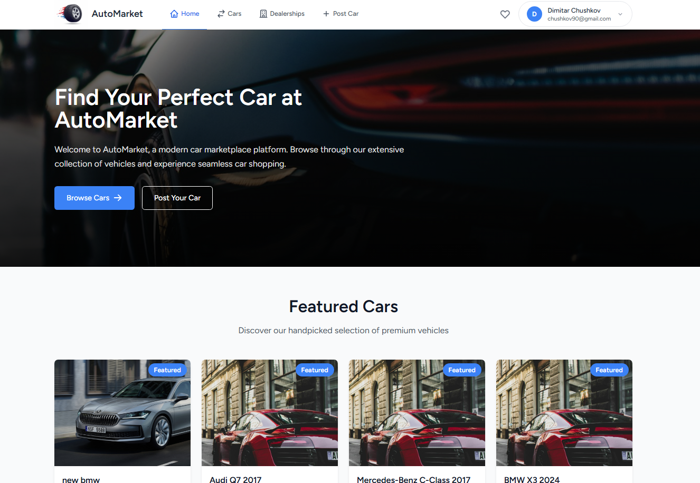
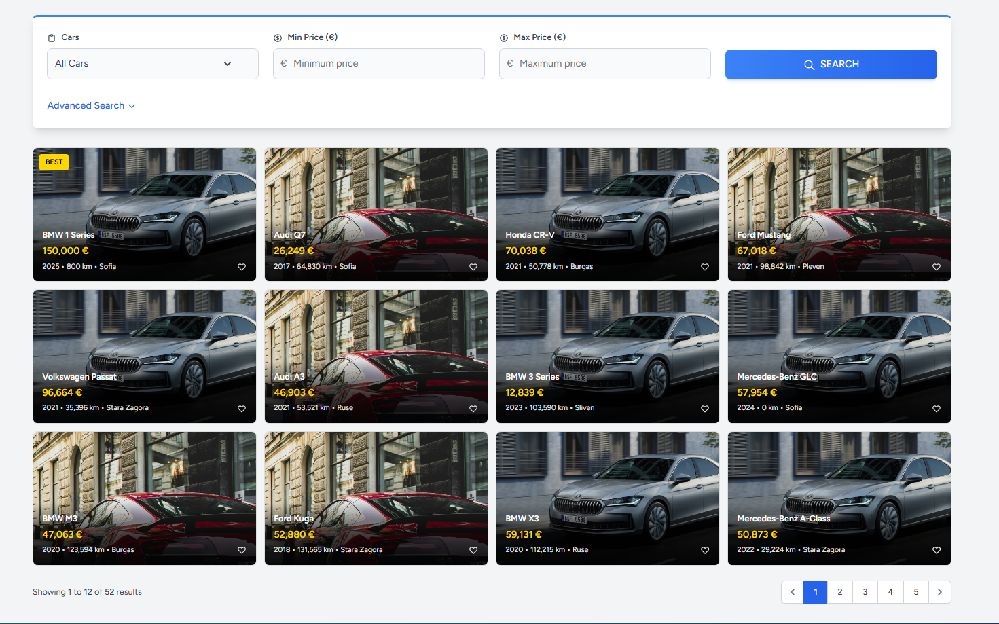
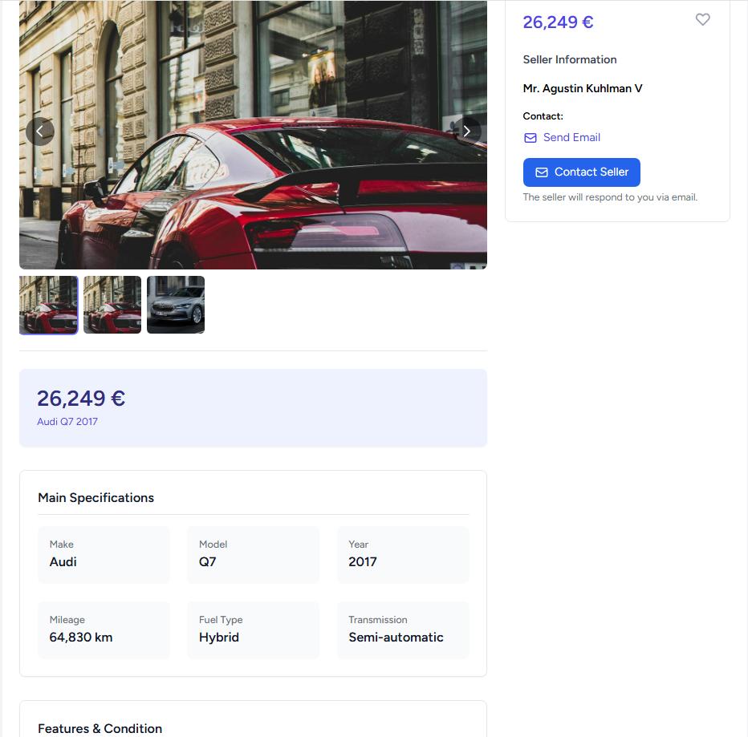
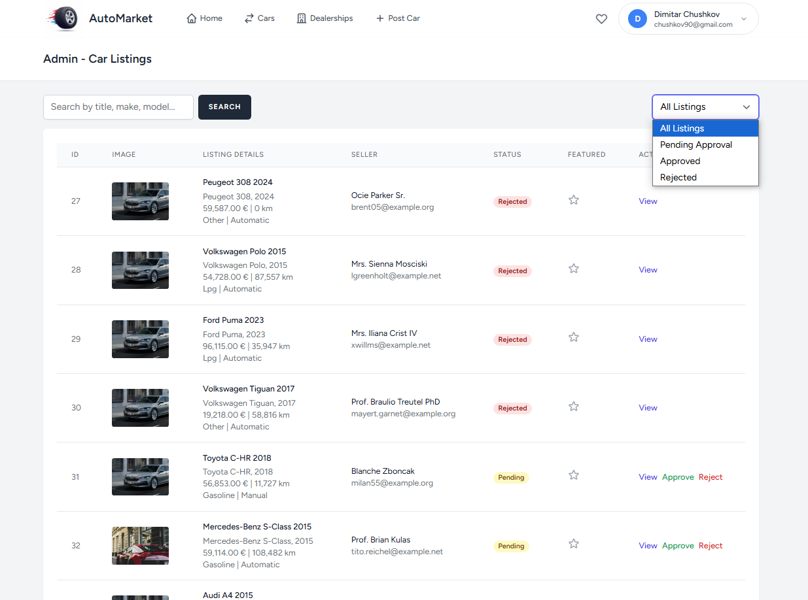
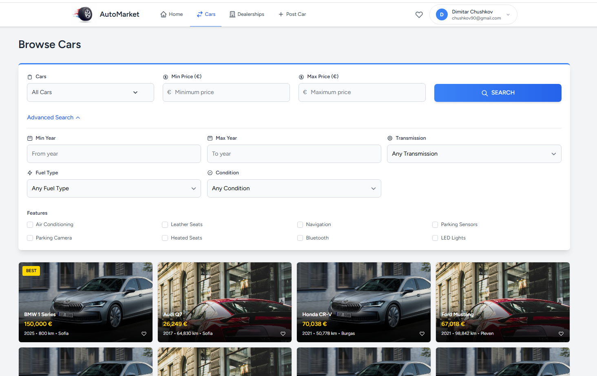
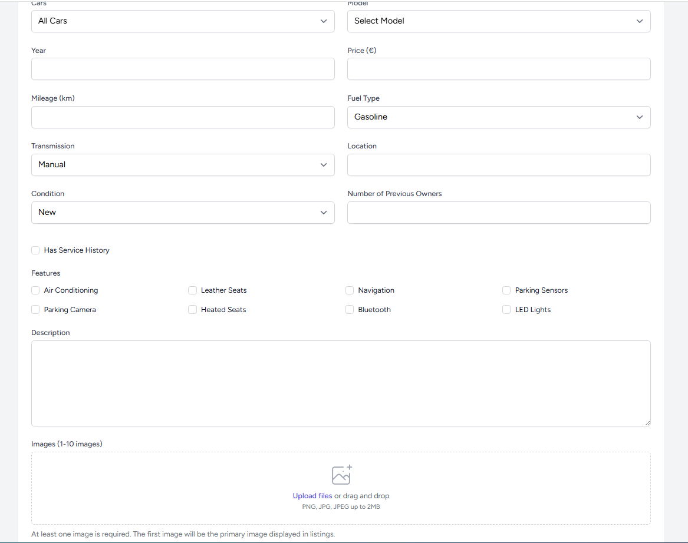

# 🚗 Auto-Market

A modern car marketplace built with Laravel, featuring a clean UI and comprehensive car listing management system.

## ✨ Features

### For Users
- 🔍 Advanced car search with multiple filters
- 📸 Multiple image upload for each car listing
- ❤️ Favorite listings system
- 📱 Responsive design for all devices
- 🗺️ Location-based listings
- 💬 Direct contact with sellers

### For Dealers/Sellers
- 📊 Dashboard for managing listings
- 📈 Statistics and insights
- 🔄 Easy listing management
- 📸 Image management system

### For Admins
- 👮 Complete admin panel
- ✅ Listing approval system
- ⭐ Featured listings management
- 👥 User management
- 📊 Advanced statistics
- 🔔 Real-time notification system

## 🛠️ Tech Stack

- **Framework:** Laravel 10.x
- **Frontend:** Blade, TailwindCSS
- **Database:** MySQL
- **Authentication:** Laravel Breeze
- **Image Storage:** Laravel Storage
- **Deployment:** Any PHP 8.1+ hosting

## 📸 Screenshots

### Homepage


### Car Listings


### Car Details


### Admin Panel


### Search Interface


### Add Car Form


## 🚀 Installation

1. Clone the repository
```bash
git clone https://github.com/dChushkov/Auto-Market.git
```

2. Install dependencies
```bash
composer install
npm install
```

3. Create environment file
```bash
cp .env.example .env
```

4. Generate application key
```bash
php artisan key:generate
```

5. Configure database in .env file
```env
DB_CONNECTION=mysql
DB_HOST=127.0.0.1
DB_PORT=3306
DB_DATABASE=auto_market
DB_USERNAME=root
DB_PASSWORD=
```

6. Run migrations and seeders
```bash
php artisan migrate --seed
```

7. Create storage link
```bash
php artisan storage:link
```

8. Compile assets
```bash
npm run dev
```

## 💡 Usage

### For Users
1. Register/Login to your account
2. Browse car listings with advanced filters
3. Save favorite listings
4. Contact sellers
5. Create your own listings
6. Receive notifications for approval/rejection of listings

### For Admins
1. Access admin panel through /admin
2. Manage car listings (approve/reject)
3. Manage users
4. View statistics
5. Mark listings as featured
6. Receive notifications when new content is added
7. Manage notifications through the notification center

## 🔔 Notification System

The application includes a comprehensive notification system that provides real-time updates for:

### Notification Types
- **Car Added**: Notifies main admins when sub-admins add new cars
- **Spare Part Added**: Notifies main admins when sub-admins add new spare parts
- **Car Approval**: Notifies car owners when their cars are approved
- **Car Rejection**: Notifies car owners when their cars are rejected
- **Spare Part Approval**: Notifies spare part creators when their items are approved
- **Spare Part Rejection**: Notifies spare part creators when their items are rejected

### Features
- Real-time notification display in header
- Comprehensive notification management page
- Filter notifications by type and read status
- Mark notifications as read/unread
- Delete notifications
- Multi-language support (Arabic/English)
- Email notifications
- Database storage
- Broadcast support for real-time updates

### Accessing Notifications
- Click the notification bell icon in the header to view recent notifications
- Click "View All Notifications" to access the full notification center
- Use filters to find specific notifications
- Mark notifications as read or delete them as needed

## 🤝 Contributing

Contributions are welcome! Please feel free to submit a Pull Request.

## 📝 License

This project is open-sourced software licensed under the [MIT license](https://opensource.org/licenses/MIT).

## 📞 Contact

For any questions or feedback, please reach out through:
- GitHub Issues
- [dChushkov](https://github.com/dChushkov)
